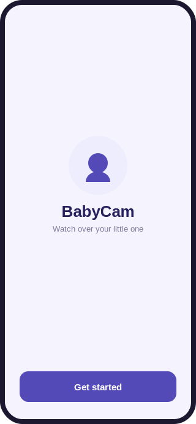
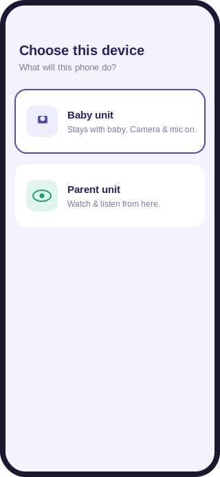
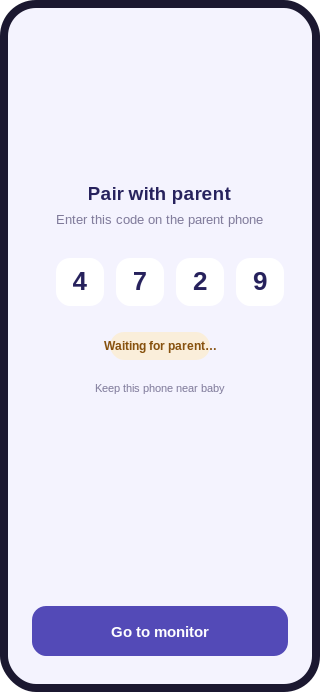
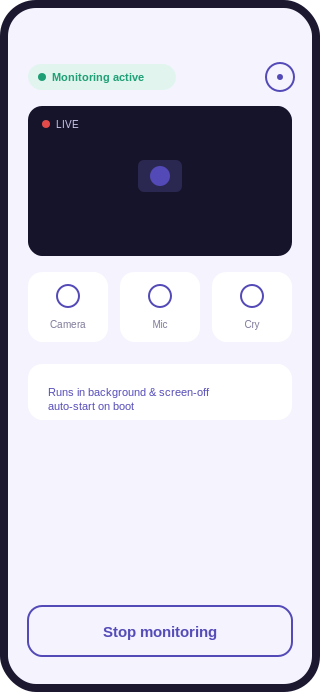
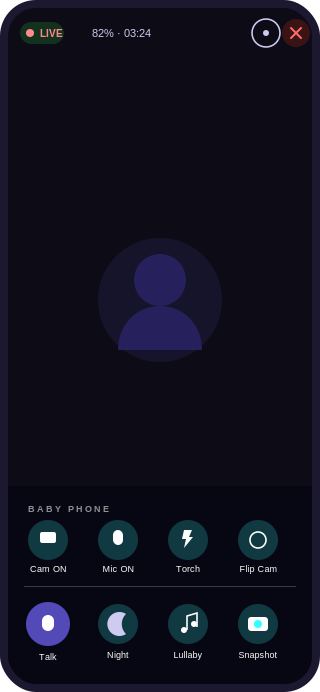

# BabyCam

A native Android baby monitor. One phone stays with the baby (camera + mic); a second phone
watches and listens from anywhere on the same network or remotely — live video, two-way talk,
cry alerts, lullabies, and full remote control of the baby phone's camera/mic/torch.

Built on a fully free infrastructure stack — no subscription, no per-user fees.
Same-network sessions connect directly (no relay). Remote sessions relay through Cloudflare
Realtime TURN (1 TB/month free tier).

> Mockups below are rendered directly from this app's actual color palette, copy, and layout
> (`ui/theme/Color.kt`, `ui/screens/*.kt`) — not photos from a running emulator.

## Screenshots

| Welcome | Choose device | Baby pairing |
|---|---|---|
|  |  |  |

| Baby — monitoring active | Parent — live view |
|---|---|
|  |  |

## Features

- **Live video + audio**, baby → parent, over WebRTC (encrypted end-to-end, DTLS-SRTP)
- **Two-way talk** — tap to talk from the parent phone to the baby's speaker
- **Full remote control of the baby phone** — parent can toggle the baby's camera, mic, and
  torch (flashlight), and flip front/back camera, without touching the baby phone
- **Parent camera share preview** — when the parent shares its own camera back to the baby, the
  parent also sees a small mirrored local preview window
- **Live diagnostics** — the parent's live view shows an expandable diagnostics panel with
  resolution, FPS, bitrate, packet loss, ICE path, signaling state, and quality mode
- **Cry detection** — on-device amplitude analysis on the baby phone, fires a local alert even
  with no parent connected
- **Lullaby / white-noise playback** — white noise, heartbeat, rain — played on the baby phone,
  controlled from the parent
- **Night mode** — low-light color treatment on the parent's live view
- **Snapshot** — save the current frame from the live feed to the parent's gallery
- **Zoom** — pinch-to-zoom (1x–4x) on the parent's live view
- **Low battery alert** — baby phone notifies the parent when its battery drops below 20%
- **Data saver** — audio-only mode to cut bandwidth/battery use
- **Persistent pairing** — once paired, reconnects automatically (MQTT auto-reconnect +
  re-subscribe, ICE restart, ping-triggered re-offer) until the parent disconnects explicitly
- **App lock** — PIN or biometric lock on app open
- **4-digit pairing code** — no QR scanner, no account; baby shows a code, parent types it in
- **Parent-authoritative privacy** — camera, microphone, cry detection, torch, and playback start
  OFF; the parent explicitly enables them while signaling remains reachable in standby
- **Mic hardware stays cold by default** — the baby-side audio sender is negotiated in
  receive-only standby and the microphone track is attached only after an explicit parent enable
- **Screen-off standby** — a foreground service keeps signaling reachable; after reboot the user
  taps a notification to unlock and resume instead of silently activating camera or microphone
- **Safe audio-route restore** — BabyCam temporarily enters communication audio mode only while
  an actual audio feature is active, then restores the phone's prior speaker/earpiece state

## Tech stack

| Layer | Choice |
|---|---|
| Language / UI | Kotlin + Jetpack Compose + Material3 |
| Real-time media | WebRTC ([`io.getstream:stream-webrtc-android`](https://github.com/GetStream/webrtc-android)) |
| Signaling / pairing | MQTT over the public [HiveMQ broker](https://www.hivemq.com/public-mqtt-broker/) — payloads encrypted with AES-256-GCM, keyed off the pairing code |
| NAT traversal | Google STUN (free) + Cloudflare Realtime TURN (1 TB/month free tier) — provider-agnostic `TurnConfig.kt`, switchable with one line |
| Background execution | Foreground Service (`camera` + `microphone` type) + `BOOT_COMPLETED` receiver |
| Local persistence | Jetpack DataStore (Preferences) |
| App lock | AndroidX Biometric |
| Local alerts | Android `NotificationManager` |

No backend of ours is involved — signaling rides on a public MQTT broker with end-to-end
encrypted payloads, so there is nothing to host or pay for.

## Architecture

```
 Baby phone                                   Parent phone
 ┌───────────────────────┐                   ┌───────────────────────┐
 │ Foreground service      │                   │ App                    │
 │  - Camera2 capture       │   WebRTC P2P media │  - live view + talk    │
 │  - WebRTC peer           │◄──────────────────►│  - WebRTC peer        │
 │  - cry detector (mic)    │   (DTLS-SRTP enc)  │  - remote control UI  │
 │  - lullaby player        │                   │  - lullaby control     │
 └────────────┬─────────────┘                   └────────────┬──────────┘
              │   offer / answer / ICE / control signals       │
              └───────────────────┬──────────────────────────┘
                                   ▼
                     Public MQTT broker (broker.hivemq.com)
                     AES-256-GCM encrypted payloads, room = pairing code
                                   │
                     Google STUN → direct P2P (same network)
                     Cloudflare Realtime TURN → relay fallback (cross-network)
```

Same-network sessions (baby at home, parent on same Wi-Fi) use direct ICE candidates — zero
relay bandwidth. Remote sessions (parent at office) fall back to Cloudflare TURN automatically.
ICE candidate priority: `host` → `srflx` (STUN) → `relay` (TURN).

## Project structure

```
app/src/main/java/com/colworx/babycam/
├── ui/
│   ├── AppNavigation.kt          ← NavHost + app-lock gate
│   ├── screens/                  ← Welcome, ChooseDevice, Permissions, Battery,
│   │                                Baby (pairing/active), Parent (live/settings/scan)
│   └── theme/                    ← Color.kt, Theme.kt
├── webrtc/
│   ├── LiveSession.kt            ← app-wide observable connection state
│   ├── BabyCamConnection.kt      ← WebRTC ↔ MQTT signaling orchestration
│   ├── WebRtcSession.kt          ← PeerConnection, camera/mic tracks
│   ├── StreamDiagnostics.kt      ← parent live-view bitrate/FPS/ICE diagnostics model
│   ├── AudioRoutingPolicy.kt     ← saves/restores the phone's original audio routing state
│   ├── TurnConfig.kt             ← provider-agnostic TURN config (Cloudflare / Metered / coturn / STUN-only)
│   ├── CloudflareTurnFetcher.kt  ← fetches ephemeral Cloudflare TURN credentials at session start
│   └── Camera2TorchController.kt ← injects FLASH_MODE_TORCH into WebRTC's Camera2 repeating request
├── signaling/
│   ├── SignalingClient.kt        ← MQTT client
│   ├── SignalCrypto.kt           ← AES-GCM payload encryption
│   └── RoomToken.kt              ← 4-digit pairing code
├── service/
│   ├── MonitorService.kt         ← foreground service, cry + battery monitoring
│   ├── MonitorController.kt
│   └── BootReceiver.kt
├── audio/
│   ├── CryDetector.kt
│   └── LullabyPlayer.kt
├── data/
│   └── AppPreferences.kt         ← DataStore preferences
└── security/
    └── PinManager.kt             ← PIN / biometric app lock
```

## Switching TURN provider

Open `webrtc/TurnConfig.kt` and change one line:

```kotlin
val ACTIVE_PROVIDER = Provider.CLOUDFLARE   // ← METERED | SELF_HOSTED_COTURN | STUN_ONLY
```

Credentials for each provider are defined in their respective objects in the same file.

## Building

Requires JDK 17 and the Android SDK (compileSdk 35, minSdk 26).

```bash
git clone https://github.com/mzashah/BabyCam.git
cd BabyCam
./gradlew assembleDebug
```

The debug APK is produced at `app/build/outputs/apk/debug/app-debug.apk`.

## Setup on two phones

1. Install the app on both phones.
2. On the phone that will stay with the baby, choose **Baby unit** and grant camera + mic
   permissions.
3. On the other phone, choose **Parent unit** and grant mic permission.
4. The baby phone shows a 4-digit code — enter it on the parent phone to pair.
5. The connection persists across app restarts; use **Settings → Forget pairing** on the parent
   to unpair.

## Platform notes

- **Android only.** iOS does not allow continuous background camera access or boot auto-start
  for third-party apps — these are OS-level restrictions, not a tooling choice.
- Tested with minSdk 26 (Android 8) through compileSdk 35 (Android 15).

## License

Private repository — personal project. Do not redistribute or reuse without permission.
